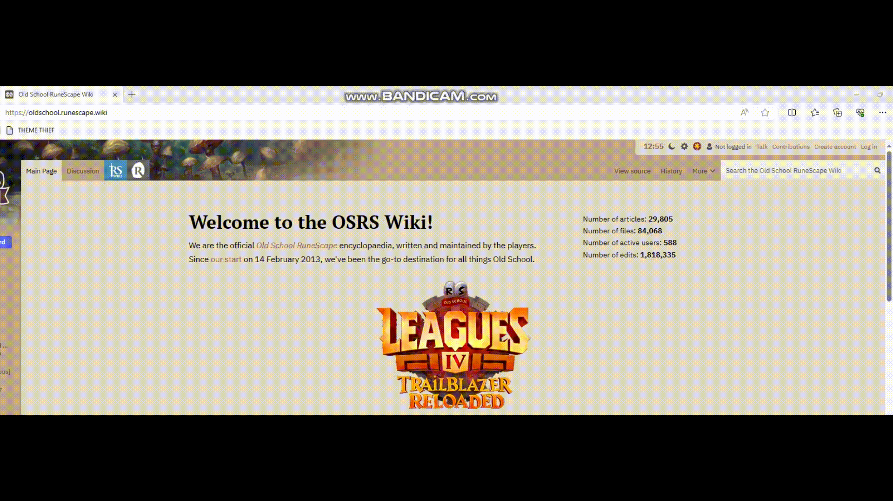

# Theme Thief

This small bookmarklet gathers all fonts and colours from a webpage into an palette, from where you can easily pick them for your own needs.
You can also download all of them at once in a JSON format.

## Demonstration

## How to use

Copy the content of [theme-thief-minify.js](theme-thief-minify.js) into bookmark URL and click the bookmark on any site you like.

## Things to consider

- All sites don't support Clipboard API so you might have to activate text mode and copy-paste text from that.

- There is a good chance that many of the fonts have to be downloaded from somewhere before you can use them on your own.

- This bookmarklet does not collect or transmit any data from the user's browser.

- We suggest that you use this bookmarklet ethically and responsibly.

## License

- MIT License